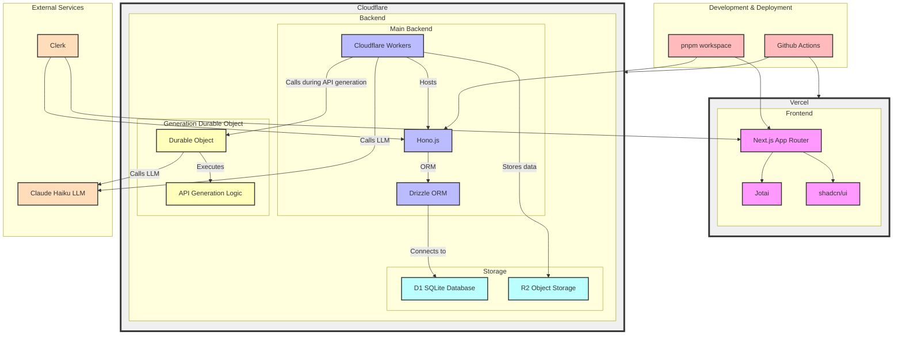

# The Hacks in the Hanabi.REST playground.

How to develop a Workers Like execution environment in the browser.

<div class="pt-12">
  <span @click="$slidev.nav.next" class="px-2 py-1 rounded cursor-pointer" hover="bg-white bg-opacity-10">
    Press Space for next page <carbon:arrow-right class="inline"/>
  </span>
</div>

<div class="abs-br m-6 flex gap-2">
  <a href="https://x.com/hanabi_rest" target="_blank" alt="GitHub"
    title="Open in Twitter"
    class="text-xl slidev-icon-btn opacity-50 !border-none !hover:text-white">
    <carbon-logo-twitter />
  </a>
  <a href="https://hanabi.rest/" target="_blank" alt="GitHub" title="Open in GitHub"
    class="text-xl slidev-icon-btn opacity-50 !border-none !hover:text-white">
   <twemoji-sparkler />
  </a>
</div>

---
layout: items
cols: 3
---

# Members

::items::


<h2 class="text-2xl!">Yuta Kobayashi</h2>
<h2 class="text-2xl!">Inaridiy</h2>
<h2 class="text-2xl!">Moons14</h2>

[<carbon-logo-github class="mr-1" />yutakobayashidev](https://github.com/yutakobayashidev)

[<carbon-logo-github class="mr-1" />inaridiy](https://github.com/inaridiy)

[<carbon-logo-github class="mr-1" />moons14](https://github.com/moons-14)

15yo, I like programming, languages, music and space.

18yo, engineer playing at LLM SFC24, seccmp23 inaridiy.eth

17yo, engineer, LLM, seccamp23 @moons_dev(X)

---

# About Hanabi.rest

Build a REST API from prompt and screenshots with LLM.

- 🏗️ **Prompt to REST** - Build a REST API from prompt and screenshots with LLM.
- 🧪 **Browser Playground** - Test and Develop APIs in the browser.
- 🚀 **One Click Deploy** - Deploy APIs to Cloudflare Workers with a one click.
- 🎨 **Local Build** - Clone API in your PC by CLI.

<div class="abs-br m-6 flex gap-2">
  
</div>

---

# Tech Stack Overview



Genereated by Claude3.5

---
layout: cover
---

# Demo

<div class="abs-br m-6 flex gap-2">
  
</div>

---
layout: section
---

# Today's Topic

::right::

##  Hanabi's Playground


---
layout: section
---

# Today's Topic

::right::

## Execute Hono with D1 in the browser
How to run Hono with D1 in your browser

## Build with external packages
Use esbuild to bundle with **external packages** into a single file

## Typescript Editor
Bundle the npm package **type definitions** into a single file and insert it into the editor

---

# Hono is Just a Function
Execute Hono with D1 in the browser#1

<div grid="~ cols-2 gap-2" m="t-2">

HonoJS APIs are simple functions that take a WebRequest and return a Response. When you pass these functions to modern runtimes like Workers or Deno, they work as web servers.


</div>

---

# Simple Example
Execute Hono with D1 in the browser#2

If you write code like this, you can create a runtime that works in the browser!

```ts
import { Hono } from "hono";

const app = new Hono();

app.get("/teapot", (c) => c.text("I'm a teapot"), 418)

... // Add more routes

const request = new Request(...);
const response = await app.fetch(request);//Ultra simple
```

---

# SQLite wasm and D1 Wrapper
Execute Hono with D1 in the browser#3

The Database is a SQLiteWasm(@sqlite.org/sqlite-wasm) covered with a Wrapper that makes it look like a D1.

```ts
export class D1Wrapper {
  private sqlite: Database;
  private stmt: { sql: string; binds?: SqlValue[] } | null = null;

  constructor(sqlite: Database) {
    this.sqlite = sqlite;
  }

  ....

  all() {
    const results = this.sqlite.exec({
      sql: this.stmt?.sql || "",
      bind: this.stmt?.binds || [],
      returnValue: "resultRows",
      rowMode: "object",
    });

    return { results };
  }
}
```

---

# Binding the database to Hono in the browser
Execute Hono with D1 in the browser#4

Binding by passing the DB as the second argument to the fetch method of Hono

```ts
import SQLite from "@sqlite.org/sqlite-wasm";

const db = new SQLite.oo1.DB();

app.get("/db", async (c) => {
  c.env.DB.prepare("SELECT * FROM table").all(); // Use the database
});

const request = new Request(...);
const response = await app.fetch(request, {
  DB: new D1Wrapper(db), // Pass the database
});
```

---

# Building with esbuild
Build with external packages#1


Hanabi uses esbuild to build its code. In doing so, external packages are also bound to a single file by retrieving them from esm.sh and bundling them
<div grid="~ cols-2 gap-2" m="t-2">

```ts
import type { Plugin } from "esbuild-wasm";

export const httpPlugin: Plugin = {
  name: "http",
  setup(build) {
    build.onResolve({ filter: /.*/ }, (args) => ({
      path: new URL(args.path, "https://esm.sh").toString(),
      namespace: "http-url",
    }));

    build.onLoad({ filter: /.*/, namespace: "http-url" }, async (args) => {
      const contents = await fetch(args.path).then((res) => res.text());
      return { contents };
    });
  },
};
```

```ts
import * as esbuild from "esbuild-wasm";
import { httpPlugin } from "./esbuild-http-plugin";

export const compile = async (code: string): Promise<string> => {
  await initEsbuild();

  const importSource = `import { jsx, Fragment } from 'https://esm.sh/hono/jsx'\n`;
  const transformed = await esbuild.build({
    ...,
    plugins: [httpPlugin], // Add the plugin
  });
  const output = transformed?.outputFiles?.[0].text;
  if (!output) throw new Error("Failed to compile", { cause: transformed?.errors });
  return output;
};
```

</div>

---

# About Typescript Editor
Typescript Editor#1

The editor of Hanabi's Playground is monaco-editor.

However, like DenoLSP, it has the ability to automatically insert type information from external packages


---

# x-typescript-types
Typescript Editor#2

When you get a package with `esm.sh`, it will be given the header `x-typescript-types`.
=> However, if the file is not bundled with a type file like Hono, only the surface layer can be read.


```ts {1}
...
import { Hono } from './hono.d.ts';
...
export type { Env, ErrorHandler, Handler, MiddlewareHandler, Next, NotFoundHandler, ValidationTargets, Input, Schema, ToSchema, TypedResponse, } from './types.d.ts';
...
export type { Context, ContextVariableMap, ContextRenderer, ExecutionContext } from './context.d.ts';
...
export { Hono };
```

---

# Bundle .d.ts with cloudflare workers
Typescript Editor#3

Using Typescript's declare module syntax, dts files are bundled using a simple algorithm

```ts
export const getBundledDts = async (module: string) => {
  const indexDotDtsUrl = await getIndexeDtsUrl(module);
  if (!indexDotDtsUrl) return "";

  let queue = [indexDotDtsUrl];
  const dtsFiles: Record<string, string> = {};
  while (true) {
    ...
  }

  // バンドルされた型定義を生成
  let formatted = Object.entries(dtsFiles)
    .map(([url, dts]) => `declare module "${replacePath(url)}"{${dts}}`)
    .join("\n");
  formatted += `declare module "${module}" {export * from "${replacePath(indexDotDtsUrl)}"}`;

  return formatted;
};
```

---
layout: fact
---


# Thank you for listening!