# The Hacks in the Hanabi.REST playground.

How to develop a Workers Like execution environment in the browser.

<div class="pt-12">
  <span @click="$slidev.nav.next" class="px-2 py-1 rounded cursor-pointer" hover="bg-white bg-opacity-10">
    Press Space for next page <carbon:arrow-right class="inline"/>
  </span>
</div>

<div class="abs-br m-6 flex gap-2">
  <a href="https://x.com/hanabi_rest" target="_blank" alt="GitHub"
    title="Open in Twitter"
    class="text-xl slidev-icon-btn opacity-50 !border-none !hover:text-white">
    <carbon-logo-twitter />
  </a>
  <a href="https://hanabi.rest/" target="_blank" alt="GitHub" title="Open in GitHub"
    class="text-xl slidev-icon-btn opacity-50 !border-none !hover:text-white">
   <twemoji-sparkler />
  </a>
</div>

---
layout: items
cols: 3
---

# Members

::items::


<h2 class="text-2xl!">Yuta Kobayashi</h2>
<h2 class="text-2xl!">Inaridiy</h2>
<h2 class="text-2xl!">Moons14</h2>

[<carbon-logo-github class="mr-1" />yutakobayashidev](https://github.com/yutakobayashidev)

[<carbon-logo-github class="mr-1" />inaridiy](https://github.com/inaridiy)

[<carbon-logo-github class="mr-1" />moons14](https://github.com/moons-14)

15yo, I like programming, languages, music and space.

18yo, engineer playing at LLM SFC24, seccmp23 inaridiy.eth

17yo, engineer, LLM, seccamp23 @moons_dev(X)

---

# About Hanabi.rest

Build a REST API from prompt and screenshots with LLM.

- 🏗️ **Prompt to REST** - Build a REST API from prompt and screenshots with LLM.
- 🧪 **Browser Playground** - Test and Develop APIs in the browser.
- 🚀 **One Click Deploy** - Deploy APIs to Cloudflare Workers with a one click.
- 🎨 **Local Build** - Clone API in your PC by CLI.

<div class="abs-br m-6 flex gap-2">
  
</div>

---

# Tech Stack Overview

```mermaid
graph TD
    subgraph "Vercel"
        subgraph "フロントエンド"
            A[NextJS AppRouter]
            B[Jotai]
            C[Shadcn/UI]
        end
    end

    subgraph "Cloudflare"
        subgraph "バックエンド"
            subgraph "メインバックエンド"
                E[HonoJS]
                G[Cloudflare Workers]
                F[Drizzle ORM]
            end

            subgraph "生成用Durable Object"
                J[Durable Object]
                O[API生成ロジック]
            end

            subgraph "ストレージ"
                H[D1 SQLiteデータベース]
                I[R2 オブジェクトストレージ]
            end
        end
    end

    subgraph "外部サービス"
        N[Claude Haiku LLM]
        K[Clerk]
    end

    subgraph "開発・デプロイ"
        L[pnpm workspace]
        M[Github Actions]
    end

    A --> B
    A --> C
    G -->|ホスト| E
    E -->|ORM| F
    F -->|接続| H
    G -->|API生成時に呼び出し| J
    J -->|実行| O
    G -->|データ保存| I
    G -->|LLM呼び出し| N
    J -->|LLM呼び出し| N
    K --> A
    K --> E
    L --> A
    L --> E
    M --> Vercel
    M --> Cloudflare

    classDef environment fill:#f0f0f0,stroke:#333,stroke-width:4px;
    classDef frontend fill:#f9f,stroke:#333,stroke-width:2px;
    classDef backend fill:#bbf,stroke:#333,stroke-width:2px;
    classDef durable fill:#ffb,stroke:#333,stroke-width:2px;
    classDef storage fill:#bff,stroke:#333,stroke-width:2px;
    classDef external fill:#fdb,stroke:#333,stroke-width:2px;
    classDef devops fill:#fbb,stroke:#333,stroke-width:2px;

    class Vercel,Cloudflare environment;
    class A,B,C frontend;
    class E,F,G backend;
    class J,O durable;
    class H,I storage;
    class N,K external;
    class L,M devops;
```


Genereated by Claude3.5

---
layout: cover
---

# Demo

<div class="abs-br m-6 flex gap-2">
  
</div>

---
layout: section
---

# Today's Topic

::right::

##  Hanabi's Playground


---
layout: section
---

# Today's Topic

::right::

## Execute Hono with D1 in the browser
How to run Hono with D1 in your browser

## Build with external packages
Use esbuild to bundle with **external packages** into a single file

## Typescript Editor
Bundle the npm package **type definitions** into a single file and insert it into the editor

---

# Hono is Just a Function

<div grid="~ cols-2 gap-2" m="t-2">

HonoJS APIs are simple functions that take a WebRequest and return a Response. When you pass these functions to modern runtimes like Workers or Deno, they work as web servers.


</div>

---

# Simple Example

If you write code like this, you can create a runtime that works in the browser!

```ts
import { Hono } from "hono";

const app = new Hono();

app.get("/teapot", (c) => c.text("I'm a teapot"), 418)

... // Add more routes

const request = new Request(...);
const response = await app.fetch(request);//Ultra simple
```

---

# SQLite wasm and D1 Wrapper

The Database is a SQLiteWasm(@sqlite.org/sqlite-wasm) covered with a Wrapper that makes it look like a D1.

```ts
export class D1Wrapper {
  private sqlite: Database;
  private stmt: { sql: string; binds?: SqlValue[] } | null = null;

  constructor(sqlite: Database) {
    this.sqlite = sqlite;
  }

  ....

  all() {
    const results = this.sqlite.exec({
      sql: this.stmt?.sql || "",
      bind: this.stmt?.binds || [],
      returnValue: "resultRows",
      rowMode: "object",
    });

    return { results };
  }
}
```

---

# Binding the database to Hono in the browser

Binding sqlite-wasm adjusted for D1 to Hono.

```ts
import SQLite from "@sqlite.org/sqlite-wasm";

const db = new SQLite.oo1.DB();

app.get("/db", async (c) => {
  c.env.DB // <= D1Wrapper
});

const request = new Request(...);
const response = await app.fetch(request, {
  DB: new D1Wrapper(db),
});
```

---

# Get a list of endpoints as an array

You can get endpoints from the runtime using inspectRoutes used in the showRoutes() function from hono/dev

```ts
import { inspectRoutes } from "hono/dev";

const requestEndpointEffect = messaging.onMessageJotai(
  "requestEndpoint",
  async (get, _set, { data }) => {
    const runtime = get(runtimeAtom);
    if (!runtime) return;
    messaging.sendEvent("updateEndpointEvent", {
      endpoints: JSON.stringify(inspectRoutes(runtime as any)),
    });
  }
);
```

---

layout: image-right
image: https://cover.sli.dev

---

# Code

Use code snippets and get the highlighting directly, and even types hover![^1]

```ts {all|5|7|7-8|10|all} twoslash
// TwoSlash enables TypeScript hover information
// and errors in markdown code blocks
// More at https://shiki.style/packages/twoslash

import { computed, ref } from "vue";

const count = ref(0);
const doubled = computed(() => count.value * 2);

doubled.value = 2;
```

<arrow v-click="[4, 5]" x1="350" y1="310" x2="195" y2="334" color="#953" width="2" arrowSize="1" />

<!-- This allow you to embed external code blocks -->

<<< @/snippets/external.ts#snippet

<!-- Footer -->

[^1]: [Learn More](https://sli.dev/guide/syntax.html#line-highlighting)

<!-- Inline style -->
<style>
.footnotes-sep {
  @apply mt-5 opacity-10;
}
.footnotes {
  @apply text-sm opacity-75;
}
.footnote-backref {
  display: none;
}
</style>

<!--
Notes can also sync with clicks

[click] This will be highlighted after the first click

[click] Highlighted with `count = ref(0)`

[click:3] Last click (skip two clicks)
-->

---

## level: 2

# Shiki Magic Move

Powered by [shiki-magic-move](https://shiki-magic-move.netlify.app/), Slidev supports animations across multiple code snippets.

Add multiple code blocks and wrap them with <code>````md magic-move</code> (four backticks) to enable the magic move. For example:

````md magic-move
```ts {*|2|*}
// step 1
const author = reactive({
  name: "John Doe",
  books: [
    "Vue 2 - Advanced Guide",
    "Vue 3 - Basic Guide",
    "Vue 4 - The Mystery",
  ],
});
```

```ts {*|1-2|3-4|3-4,8}
// step 2
export default {
  data() {
    return {
      author: {
        name: "John Doe",
        books: [
          "Vue 2 - Advanced Guide",
          "Vue 3 - Basic Guide",
          "Vue 4 - The Mystery",
        ],
      },
    };
  },
};
```

```ts
// step 3
export default {
  data: () => ({
    author: {
      name: "John Doe",
      books: [
        "Vue 2 - Advanced Guide",
        "Vue 3 - Basic Guide",
        "Vue 4 - The Mystery",
      ],
    },
  }),
};
```

Non-code blocks are ignored.

```vue
<!-- step 4 -->
<script setup>
const author = {
  name: "John Doe",
  books: [
    "Vue 2 - Advanced Guide",
    "Vue 3 - Basic Guide",
    "Vue 4 - The Mystery",
  ],
};
</script>
```
````

---

# Components

<div grid="~ cols-2 gap-4">
<div>

You can use Vue components directly inside your slides.

We have provided a few built-in components like `<Tweet/>` and `<Youtube/>` that you can use directly. And adding your custom components is also super easy.

```html
<Counter :count="10" />
```

<!-- ./components/Counter.vue -->
<Counter :count="10" m="t-4" />

Check out [the guides](https://sli.dev/builtin/components.html) for more.

</div>
<div>

```html
<Tweet id="1390115482657726468" />
```

<Tweet id="1390115482657726468" scale="0.65" />

</div>
</div>

<!--
Presenter note with **bold**, *italic*, and ~~striked~~ text.

Also, HTML elements are valid:
<div class="flex w-full">
  <span style="flex-grow: 1;">Left content</span>
  <span>Right content</span>
</div>
-->

---

## class: px-20

# Themes

Slidev comes with powerful theming support. Themes can provide styles, layouts, components, or even configurations for tools. Switching between themes by just **one edit** in your frontmatter:

<div grid="~ cols-2 gap-2" m="t-2">

```yaml
---
theme: default
---
```

```yaml
---
theme: seriph
---
```


</div>

Read more about [How to use a theme](https://sli.dev/themes/use.html) and
check out the [Awesome Themes Gallery](https://sli.dev/themes/gallery.html).

---

# Clicks Animations

You can add `v-click` to elements to add a click animation.

<div v-click>

This shows up when you click the slide:

```html
<div v-click>This shows up when you click the slide.</div>
```

</div>

<br>

<v-click>

The <span v-mark.red="3"><code>v-mark</code> directive</span>
also allows you to add
<span v-mark.circle.orange="4">inline marks</span>
, powered by [Rough Notation](https://roughnotation.com/):

```html
<span v-mark.underline.orange>inline markers</span>
```

</v-click>

<div mt-20 v-click>

[Learn More](https://sli.dev/guide/animations#click-animations)

</div>

---

# Motions

Motion animations are powered by [@vueuse/motion](https://motion.vueuse.org/), triggered by `v-motion` directive.

```html
<div
  v-motion
  :initial="{ x: -80 }"
  :enter="{ x: 0 }"
  :click-3="{ x: 80 }"
  :leave="{ x: 1000 }"
>
  Slidev
</div>
```

<div class="w-60 relative">
  <div class="relative w-40 h-40">
    
    
    
  </div>

  <div
    class="text-5xl absolute top-14 left-40 text-[#2B90B6] -z-1"
    v-motion
    :initial="{ x: -80, opacity: 0}"
    :enter="{ x: 0, opacity: 1, transition: { delay: 2000, duration: 1000 } }">
    Slidev
  </div>
</div>

<!-- vue script setup scripts can be directly used in markdown, and will only affects current page -->
<script setup lang="ts">
const final = {
  x: 0,
  y: 0,
  rotate: 0,
  scale: 1,
  transition: {
    type: 'spring',
    damping: 10,
    stiffness: 20,
    mass: 2
  }
}
</script>

<div
  v-motion
  :initial="{ x:35, y: 30, opacity: 0}"
  :enter="{ y: 0, opacity: 1, transition: { delay: 3500 } }">

[Learn More](https://sli.dev/guide/animations.html#motion)

</div>

---

# LaTeX

LaTeX is supported out-of-box powered by [KaTeX](https://katex.org/).

<br>

Inline $\sqrt{3x-1}+(1+x)^2$

Block

$$
{1|3|all}
\begin{array}{c}

\nabla \times \vec{\mathbf{B}} -\, \frac1c\, \frac{\partial\vec{\mathbf{E}}}{\partial t} &
= \frac{4\pi}{c}\vec{\mathbf{j}}    \nabla \cdot \vec{\mathbf{E}} & = 4 \pi \rho \\

\nabla \times \vec{\mathbf{E}}\, +\, \frac1c\, \frac{\partial\vec{\mathbf{B}}}{\partial t} & = \vec{\mathbf{0}} \\

\nabla \cdot \vec{\mathbf{B}} & = 0

\end{array}
$$

<br>

[Learn more](https://sli.dev/guide/syntax#latex)

---

# Diagrams

You can create diagrams / graphs from textual descriptions, directly in your Markdown.

<div class="grid grid-cols-4 gap-5 pt-4 -mb-6">


</div>

[Learn More](https://sli.dev/guide/syntax.html#diagrams)

---

foo: bar
dragPos:
square: 691,33,167,\_,-16

---

# Draggable Elements

Double-click on the draggable elements to edit their positions.

<br>

###### Directive Usage

```md

```

<br>

###### Component Usage

```md
<v-drag text-3xl>
  <carbon:arrow-up />
  Use the `v-drag` component to have a draggable container!
</v-drag>
```

<v-drag pos="642,185,253,_,-15">
  <div text-center text-3xl border border-main rounded>
    Double-click me!
  </div>
</v-drag>


---

src: ./pages/multiple-entries.md
hide: false

---

---

# Monaco Editor

Slidev provides built-in Monaco Editor support.

Add `{monaco}` to the code block to turn it into an editor:

```ts {monaco}
import { ref } from "vue";
import { emptyArray } from "./external";

const arr = ref(emptyArray(10));
```

Use `{monaco-run}` to create an editor that can execute the code directly in the slide:

```ts {monaco-run}
import { version } from "vue";
import { emptyArray, sayHello } from "./external";

sayHello();
console.log(`vue ${version}`);
console.log(
  emptyArray<number>(10).reduce(
    (fib) => [...fib, fib.at(-1)! + fib.at(-2)!],
    [1, 1]
  )
);
```

---

layout: center
class: text-center

---

# Learn More

[Documentations](https://sli.dev) · [GitHub](https://github.com/slidevjs/slidev) · [Showcases](https://sli.dev/showcases.html)
